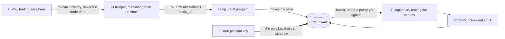
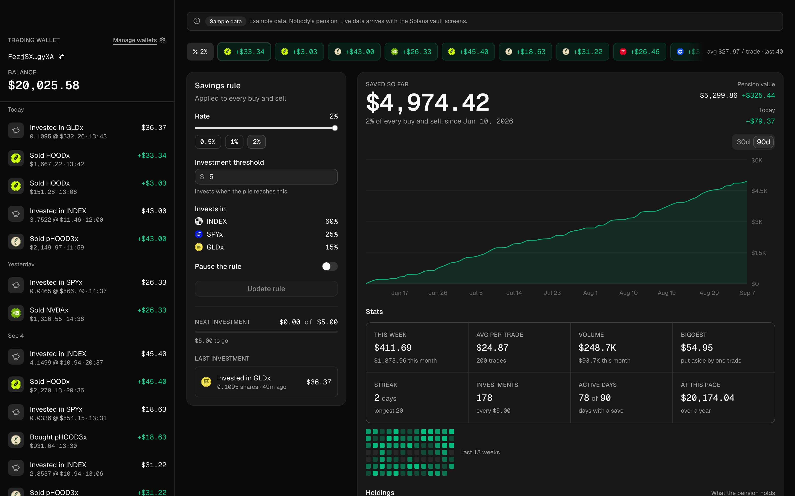

<div align="center">

<h1><a href="https://screen.studio/share/3qBq1Shw">→ VIDEO SHOWING HOW IT WORKS END TO END ←</a></h1>

<picture>
  <source media="(prefers-color-scheme: dark)" srcset="packages/website-oficial/public/logo/sip-mark-white.png">
  
</picture>

# SaverFi

### A pension you build one trade at a time.

**Every buy and every sell puts a slice into a vault only you can open — and that slice buys real tokenized stock.**<br>
No deposit. No decision to save. Trade where you already trade.

<br>

[](https://sip-website-oficial.vercel.app)
[](https://x.com/SaverFi)
[](https://solscan.io/account/6kA9H9zQT6PW5xWkXoAFCS3NotxarzaYqj66mjMf9w4J)


</div>

---

<div align="center">


<sub><b>A trade fills. A slice is put aside. The vault buys real tokenized stock — and only your key can open it.</b></sub>

</div>

---

## The idea

People who trade every day rarely save. Not because they can't — because saving is a separate decision, made on a separate day, with money that already feels spent.

SaverFi removes the decision. You link the wallet you already trade with. After each trade, a slice — a share of the profit, or a share of the volume — is moved into a **vault that only your pension key can open**, and when enough has piled up, the vault buys the tokenized assets you chose.

You keep trading wherever you like. GMGN, Axiom, your own router — it makes no difference, because nothing sits in your execution path.

---

## It already happened on mainnet

Not a testnet, not a simulation. Real trades, measured, settled and invested by this code. Every line below is a link you can open right now.

| Step | What happened | Proof |
|---|---|---|
| **1. Vault created** | The owner's pension key signed the vault into existence | [`5EMtg7aY…`](https://solscan.io/tx/5EMtg7aYUG7fqN8h9heZ8Ht6dNbmKd1tYkkG7UTA19gMcFaSbG2kzKrs2YaEaiZiyevQ8KV9gojS7wKo1Rk3RVQd) |
| **2. Trading wallet linked** | A wallet bound to that vault, with its rate | [`55oN6Nxu…`](https://solscan.io/tx/55oN6NxuNViZZJ2g3VJDbu4Vgor2JiCntYqpW1aaZfEWddQxTSnTm7KenwPDXjFmAWzxZ8pLGBsEEZJo1sp2BqyV) |
| **3. The slice was taken** | `settle_v2` moved **0.036634582 SOL** into the vault — exactly 20 % of the 0.183172913 SOL that trading session made | [`2tE3BMTa…`](https://solscan.io/tx/2tE3BMTa6BPUmxaWvxDPEaK4piZ3KKL7pXGpmRHcUy6fHD2AK66rF6XnAKbNADKaarjSNGxTHqxqJpGFZ79vzvpy) |
| **4. The slice bought stock** | The vault wrapped, converted, and swapped through Raydium CLMM into **SPYx** | [`2YdLAtx…`](https://solscan.io/tx/2YdLAtxPYSUu4EJJrN9wiqXnPJhiWHEF3F9d14XoJAUD7X9qFLeQB64hmC6wmHbJoaVwCzd6zLzwXM3uux2c2MBw) |
| **5. Then it bought again, through an aggregator** | On 2026-09-22 the owner re-signed the vault's policy onto **Jupiter v6**, and the vault wrapped, converted and bought SPYx through it — `invest` CPI'ing Jupiter, Jupiter routing Orca Whirlpool, Token-2022 settling the transfer | [`2KGe82ER…`](https://solscan.io/tx/2KGe82ERi3PJ8wJhXgHoLvMatvM4HhdUd5QrUU6TAPap4QdjdpfdnpCEqo77zRCpgJxSxck8G4z7hwbTmXUodL7S) |
| **6. Then a basket of two** | The owner signed SPYx + ANTHROPIC, and the next deposit bought **both legs**, each through Jupiter on its own venue — the first PreStocks leg this vault has held | [`2w5Uwo6X…`](https://solscan.io/tx/2w5Uwo6XonpG8s1epuoHtbPF7V5pnjNXDK6jch2k5pJDXmu9dyKYT1rFGFy9XiffTr7Lw8JZENfipYvXwF4h8SRS) · [`43S4uAxY…`](https://solscan.io/tx/43S4uAxYbAUQApfwBkybtG3DLMMeoXsPqrg3qYhTRWCiBqCnQTPupcwmYn7d6vtPf2TQ4gUHLCQcLnzT47LBh12C) |
| **7. And it saved again** | On 2026-09-23 a second trading session was settled: `settle_v2` moved **0.028372759 SOL** into the vault, at the 25 % rate the owner had signed from the live page that morning | [`5nGb2hqz…`](https://solscan.io/tx/5nGb2hqzdwko4ocpPvKaUKFZ7qnhpVET9Kf9xoVvtM4c1K5wVxgXP19CjoXZg1bTdjRmuryXqisiDSokR3953zc6) |
| **8. Then it switched to volume** | On 2026-09-25 the owner's pension key signed `set_policy_v2`, moving the vault from 25 % of profit to **1 % of every buy and every sell** | [`4iyqFNcx…`](https://solscan.io/tx/4iyqFNcx1N6dGPX8sGQGiiDcEdYqwUxRYuNnFQBiiprCWinkXCJBNRLzMGBVzbADt547YK2nxgp6ECzxFuXeo5Ki) |
| **9. And saved on volume** | Minutes later, three `settle_v2` in volume mode moved **0.043755651 SOL** into the vault — 1 % of the 4.375565225 SOL the owner's next five trades bought and sold — and the vault converted it to USDC | [`5JYcviq5…`](https://solscan.io/tx/5JYcviq52S49mXuHT3iVi9ritB55uyLcjcvLk2xUXYCVgsEG3q8HdmQuHJsBr6irwBxG8aqvfRjbGzAjMCLaWHxT) · [`3NwEBhhy…`](https://solscan.io/tx/3NwEBhhy426ABfpqb9CHwap3GNBsHXkjQr4e94H6LmhUPKvACz5i2cyWM1YR5YK6Nct6TQsyJtCJ6s4o2bjuvqoS) · [`2u5bR3CL…`](https://solscan.io/tx/2u5bR3CLCvMQCE8M2JbY5uiztsmLBmzJR4tD7qqSSQHZQXJoVVs7mSbvuFdV5nMYJiLf7d5iR34EZw4LBJNUpTEB) |
| **10. And it is still there** | At 18:45 UTC on 2026-09-25 the vault holds **0.029 SPYx** and **0.011 ANTHROPIC** (PreStocks) — positions paid for by trading profit and the owner's own test deposits — plus **7.98 USDC** from that day's profit and volume settlements, waiting until it holds the $10 its two-stock basket needs before it buys | [vault `EFXK995P…`](https://solscan.io/account/EFXK995PV49Qz8xPSYMEUDBU5AKRR466JkgsfuGak5iU) |

The keepers that did it — one settles profit vaults and invests every vault, the other settles volume vaults — are running right now and say so in public:

```bash
curl -s https://sip-solana-keeper-production.up.railway.app/status | jq '{role, mode, armed, sweeps, alerts}'
curl -s https://sip-solana-volume-keeper-production.up.railway.app/status | jq '{role, mode, armed, sweeps, alerts}'
```

---

## How it works



**Nothing is in your execution path — on purpose.** A Privy policy can allow or deny a transaction, but it cannot add an instruction to one, and a router of ours would only ever see our own trades. So the slice is measured *after* the fact, from the chain itself, and collected by a signed settlement. That is what lets you trade anywhere and still save.

**The measurement is attested, not trusted.** The keeper signs an Ed25519 attestation of what it measured; the program verifies that signature against the attester named in its own on-chain config, checks a nonce and a frontier slot so no window is replayed or run backwards, clamps the result to the vault's maximum contribution, and refuses outright if the settlement would push the trading wallet below the reserve its owner set.

**The venue is yours, and it is pinned.** `invest` will only CPI the program named in the policy you signed, byte for byte. The keeper cannot route anywhere else, and the day it learns a new venue, the only way that venue reaches your vault is you signing for it.

**Linking a wallet takes a third signature.** Not just the owner's and the wallet's on the transaction — the wallet also signs a separate 140-byte consent naming this program, this wallet, this vault and this owner, which the program verifies before it will bind anything. It matters because a Privy policy for a custom program can only match the program id: a seat allowed to sign `settle_v2` is also allowed to sign `link_wallet`, and could otherwise bind a fresh wallet to a stranger's vault. What that seat cannot do is sign a *message*. The consent starts with the byte `0xFF`, which no Solana transaction can begin with, so those bytes can never be replayed as one.

**The keeper is dry by default.** A dry run never even reads a signing secret. Moving money takes an explicit arming variable *and* a byte-exact confirmation sentence *and* the on-chain config naming the keeper's key — a conjunction it re-asks on every single sweep.

---

## What's on chain

The `sip_vault` program — [`6kA9H9zQT6PW5xWkXoAFCS3NotxarzaYqj66mjMf9w4J`](https://solscan.io/account/6kA9H9zQT6PW5xWkXoAFCS3NotxarzaYqj66mjMf9w4J) — is 17 instructions, 4 account types and 39 named errors.

**The bytes running on mainnet are the bytes this repository tests.** Not "built from this source" — the same file. Check it yourself:

```bash
solana program dump 6kA9H9zQT6PW5xWkXoAFCS3NotxarzaYqj66mjMf9w4J /tmp/sip_vault.so -u mainnet-beta
shasum -a 256 /tmp/sip_vault.so
# 60e94348d7cf841ac4542b356ed1719047c33256a96894e3a12bdf32c63de823
# …identical to packages/solana-program/target/deploy/sip_vault.so, and to the
#   hash the keeper's local-validator tests pin their run against.
```

<details>
<summary><b>The instruction set</b></summary>

| | |
|---|---|
| **Setting up** | `init_config` · `create_vault_v2` · `link_wallet` · `unlink_wallet` |
| **Saving** | `settle_v2` — the attested slice, the only way value enters a vault |
| **Investing** | `wrap_sol` · `convert` · `invest` — SOL → wSOL → USDC → the assets in your policy |
| **Your controls** | `set_policy_v2` · `set_invest_policy` · `withdraw` · `withdraw_token` |
| **Protocol** | `set_attester` · `set_keeper` · `set_protocol_paused` · `transfer_authority` · `accept_authority` |

Authority transfer is two-step — an offer, then an acceptance — so a mistyped address cannot orphan the protocol.

</details>

<details>
<summary><b>The two ways a vault measures</b></summary>

- **Realized profit** — a slice of what the trading made. The web starts at **20 %** and the owner can change it from the live page; the program accepts 2.01 % – 100 %.
- **Volume** — a slice of the size of every buy and every sell, winning or losing, so a round trip is charged on both legs. The web starts at **1 %**, with 0.5, 1 and 2 % presets; the program accepts 0.01 % – 2 %.

**Both have been offered since 2026-09-25.** A vault moves between them with one `set_policy_v2` signed by the pension key, from *Vault settings* (the gear on the Savings rule card); a new vault can start on Volume from the vault card, while the first-run setup still starts every vault on Profit. Each mode is settled by its own keeper service.

A transaction counts as volume when the trading wallet signed it, it succeeded, it is not a plain transfer or one of SaverFi's own settlements, and the wallet's SOL (wrapped SOL included) moved one way while another token moved the other. Its size is how far the wallet's SOL moved, not counting the network fee or the rent of the wallet's token accounts opened or closed. Wrapping, unwrapping, transfers and failed swaps never count. Only SOL is measured, so a swap with no SOL leg, such as USDC into a token, counts just the SOL the wallet pays beside it, such as a tip — a gap that can only charge less, never more. A volume slice settles once it owes 0.001 SOL, or an hour after its oldest trade. Trades made before a switch to Volume, or before a change of its rate, are forgiven rather than charged at the new rule.

</details>

---

## The app

<div align="center">
  
  <br><i>The dashboard, shown here with the seeded sample data every visitor sees before connecting — labelled "Sample data" in the product itself, because an example must never wear a live badge.</i>
</div>

Connect a Solana wallet and every number is read from mainnet through the app's own routes: your vault, your policy, live pool prices, what the vault holds and what it has saved. Login is external wallets only — Phantom, Backpack, Solflare — with no embedded wallet and no custody.

---

## Latest update

The newest day of the [changelog](CHANGELOG.md), copied here each morning. Every earlier day is in the full file.

<!-- latest-changelog:start -->
<details>
<summary><b>2026-09-25</b> — Volume mode goes live: a second keeper service, Volume offered across the web from 1 % and the owner's vault saving 1 % of five real trades on mainnet; a public page shows the vault's prices beside Pyth's and PreStocks' (partial)</summary>

<br>

The day SaverFi started saving by volume. Early in the morning the owner asked for a keeper that
charges on trading volume alone, with a report first; by the evening a second keeper service was
live on Railway, Volume was offered across the web, and the owner's own vault had switched to
1 % and saved three times from real trades on mainnet. Overnight, before any of that, the
follow-ups to the PreStocks issuer's 3 % fee were finished, and in the evening a public page
began showing the vault's prices beside Pyth's and PreStocks'. 40 commits reached main between
01:16 and 19:42 Lisbon (four of them merges, one the previous day's changelog). Every volume
settlement so far is the owner's: the program still holds exactly one vault.

**Volume mode — from a report in the morning to three settlements in the evening**

- **The owner's decision.** The plan report `25474d0` recommended one keeper, tried first as a
  dry shadow, with real charging only after the hackathon's close. The owner approved its rules
  and overruled that part: start straight away with a separate keeper, so that what already
  works stays apart from what is still being proven. The owner's rules for it: low rates,
  because both legs of a round trip count; measured in SOL; a plain transfer is never charged.
  The landing's volume line stays as the owner decided that morning `d5a77d5`.
- **A second keeper service** `80bea12` `0ff6dac`. It is built from the same keeper package and
  told apart by a single role setting; it runs under its own Postgres lock, never invests and
  has no doorbell. Each keeper settles exactly one mode and leaves the other mode's vaults to the
  other keeper; the profit keeper still invests every vault, volume vaults included. A volume
  keeper refuses to start on a service that holds the doorbell's secret, so a role set on the
  wrong service fails the deploy instead of silently stopping profit settlements `7e86007`. It
  reached main at 17:27 UTC (18:27 Lisbon) through `a34e90c`, on the owner's "push"; the owner
  set up the Railway service, dry first and then armed, and the runbook has a new section for
  it `f1d82f8`. At 18:00 UTC the two `/status` pages showed the profit keeper restarted as
  `role: profit` at 17:29:56 UTC and the volume keeper live and armed since 17:32:58 UTC.
- **What counts as volume.** A transaction the trading wallet signed, that succeeded, that is
  not a plain transfer or one of SaverFi's own settlements, and in which the wallet's SOL
  (wrapped SOL included) moved one way and another token the other. Its size is how far the
  wallet's SOL moved, not counting the network fee or the rent of the wallet's token accounts
  opened or closed, and both legs of a round trip count. Wraps, unwraps, a transfer carrying a
  memo and failed swaps count as nothing; a swap with no SOL leg counts only the SOL the wallet
  pays beside it, such as a tip. Each gap charges less, never more. The rules are pinned to
  real mainnet transactions — a failed swap, a USDC-to-token swap, a memo transfer, a wrap and
  an unwrap among them `f236410` `aa96312` `2484812`.
- **When it charges.** A volume slice settles once it owes 0.001 SOL, or an hour after its
  oldest trade. Only trades after the vault's last change of mode or volume rate are charged;
  those before are forgiven, and a pause forgives nothing. Where the keeper cannot tell when
  that change was — an index that lags, an owner history too long to read — it forgives rather
  than charges `8b68e9a` `6d786b1`. Each settlement still moves at most the vault's cap
  (0.06 SOL by default, 6 SOL of trading at 1 %), and what is owed above it is not carried over.
- **The switch and the first volume settlements.** At 17:41:26 UTC the owner's pension key moved
  the vault from 25 % of profit to 1 % of volume
  ([`4iyqFNcx…`](https://solscan.io/tx/4iyqFNcx1N6dGPX8sGQGiiDcEdYqwUxRYuNnFQBiiprCWinkXCJBNRLzMGBVzbADt547YK2nxgp6ECzxFuXeo5Ki));
  the profit rate stays stored on the vault. The owner then made five trades, and the volume
  keeper settled at 17:45, 17:46 and 17:47 UTC: 0.009261436 + 0.005122619 + 0.029371596 =
  **0.043755651 SOL**, 1 % of the 4.375565225 SOL they bought and sold
  ([`5JYcviq5…`](https://solscan.io/tx/5JYcviq52S49mXuHT3iVi9ritB55uyLcjcvLk2xUXYCVgsEG3q8HdmQuHJsBr6irwBxG8aqvfRjbGzAjMCLaWHxT) ·
  [`3NwEBhhy…`](https://solscan.io/tx/3NwEBhhy426ABfpqb9CHwap3GNBsHXkjQr4e94H6LmhUPKvACz5i2cyWM1YR5YK6Nct6TQsyJtCJ6s4o2bjuvqoS) ·
  [`2u5bR3CL…`](https://solscan.io/tx/2u5bR3CLCvMQCE8M2JbY5uiztsmLBmzJR4tD7qqSSQHZQXJoVVs7mSbvuFdV5nMYJiLf7d5iR34EZw4LBJNUpTEB)).
  Re-running the keeper's measurement over those five trades gives each base to the lamport,
  and none reached the cap. The wallet made no trade between its last profit settlement and the
  switch, so the switch's forgiveness has not been exercised on mainnet yet.
- **Where the savings went.** Earlier that afternoon, still on profit, the vault had saved
  0.022141459 SOL at 25 %. The keeper wrapped and converted all four settlements into USDC; the
  vault holds 7.975313 USDC, under the $10 its two-stock basket needs before it buys ($5 a
  leg), so nothing saved on volume has bought stock yet. Settlement has now run six times on
  this vault — three at profit, three at volume — and the six payments add up exactly to its
  `lifetime_saved`, 0.130904451 SOL.

**Web — Volume across the site**

- **Vault settings** `3c21aa4`. What the owner asked for that morning: a gear on the Savings
  rule card that holds everything that changes the vault — how it saves (profit or volume, a
  rate bar with presets, pause) and what it buys (assets by category and their shares, and an
  investment threshold that starts at $10 whatever the number of assets) — with a "?" on every
  title that explains it. It can also re-sign the stored basket at today's prices ("Refresh
  price limits").
- **Volume can be chosen** `22b5dc0` `e92e663`. A Profit | Volume toggle in Vault settings, and
  a Volume option when creating a vault from the vault card, both starting at 1 % — the owner's
  choice, 1 % of the buy and 1 % of the sell — with 0.5, 1 and 2 % presets. Before the wallet
  asks, the switch says what it means: every buy and every sell counts, in SOL, win or lose;
  plain transfers never do; what the profit rule had not charged yet is forgiven; nothing above
  the per-settlement cap is carried over. The first-run setup still starts on Profit.
- **"In buys and sells"** `8ed069e`. On a first look at the feed the owner saw what read like a
  trade of more than $300 that the owner had never made. It was a wording problem, not a
  counting one: the third settlement's row showed about $355 of "volume", which was a buy and a
  sell 4 s apart, added together. Rows now read "1 % of $X in buys and sells", and the savings
  panel says "Now 1% of every buy and sell · saving since Sep 18, 2026" instead of crediting the
  whole total to today's rule.
- **Also on the dashboard.** The savings chart reads 1h · 1d · 7d — a point an hour over 7
  days, a day over 30, a week over six months — each ending at the hero's total; the weeks'
  squares always show 13 weeks; and the vault's address, copyable and linked to Solscan, sits
  under the total, as the owner asked `fa7d3a3`. The logo now leads to `/welcome`, which shows
  the landing to anyone: a connected key at the site's root goes straight to its pension, so
  the owner had stopped seeing the landing `ea91df0`. The onboarding's two clips were remade as
  5 s loops in the launch film's look — six trading terminals sending "+0.04 SOL" to SaverFi,
  then SaverFi sending it into a vault only your key opens `66c3633`.
- All of it is live: the production site is built from `50d0d51`, which contains every commit
  in this entry.

**Prices anyone can check, without a wallet**

- A public page sets what the vault buys beside what Pyth and PreStocks say, so a judge with no
  wallet can see both `73ec97c`. `/prices` answers as JSON and `/prices/view` is the page for a
  reader, both built by the same loader so they cannot disagree `50d0d51`. The SOL pool's price
  stands beside Pyth's SOL/USD over USDC/USD, SPYx beside Pyth's own SPYx feed, and ANTHROPIC
  beside PreStocks' own API, with the fee in force and the one written for epoch 1043. Every
  figure carries its age or its source. Both answer on the production site (checked at 18:46
  UTC).
- The keeper's oracle gate, on main, now also reads the confidence Pyth publishes beside each
  price: while either feed's band is wider than 50 bps of its own price, no SOL is converted
  `73ec97c`. It already held back on a price more than 60 s old or 5 % away from the route it
  captured. Neither keeper's `/status` names the commit it runs, so whether the live keepers
  have this yet is not established.

**The 3 % fee, finished overnight**

- Through the night the keeper refused the owner's basket on every sweep and Telegram kept
  repeating "A basket cannot be bought": with 3 % written for a coming epoch, the keeper priced
  its minimum out as if that fee were already charged, and landed under the floor the owner had
  signed. **Keeper:** the fee that counts is the one in force in the epoch the transaction lands
  in, and a rise written for the next epoch counts only in the current epoch's last 9,000 slots
  `3378b4e`; when the figure still falls under the owner's floor but the route covers that
  floor, the minimum drops to the floor instead of refusing, and the fee warning is sent once,
  not every sweep `df6ca67`. **Web and core:** each leg's floor is signed net of that leg's fee,
  5 % under the price, 7 % when the fee is 3 % `bea18cf`; the investing card tells a floor some
  routes can fill from one none can, and asks to sign again only for the second; the fee ceiling
  binds only the stocks chosen `986b8be` `adb294b` `f777f61`, merged `6964044` and published at
  05:01 Lisbon. Two commits that touch only tests, comments and docs hold numbers that core and
  the web quote from the keeper to one shared vector, instead of reading the keeper's source as
  text `31d7361` `6e4dc6a`.
- No buy could have followed overnight in any case: since 16:35 UTC on 2026-09-23 the vault had
  held 5.504376 USDC and no SOL beyond its rent, under the $10 its two-stock basket needs at $5
  a leg. At 16:46 UTC the owner re-signed the vault's investing policy
  ([`8memxAEd…`](https://solscan.io/tx/8memxAEdbhpFNupyYfVWLyzR8SBZwd8UKzzdZgta9kUMWPvvLgaAVCfBg9yqDWN9jZVS8EBULrURKL4MwDHJR17)),
  at 16:47:08 sent 7 USDC straight into the vault
  ([`4Ax3gKfZ…`](https://solscan.io/tx/4Ax3gKfZfmN8Hj3o2yYJ97KsmW4jPzXKNR23KbXhRT8FRy538GJ5y14fZKsTnPjy3Mg8U79H3Lm9cEWPkkHVq6Hy)),
  and 40 s later the keeper bought both legs, 6.25 USDC each
  ([`4Kam49yG…`](https://solscan.io/tx/4Kam49yGYiJpKtNbt6LoBqJqVdfUmrBJW2cXCkKTo85eoNZo1ndjxQv8W1jhSKm3egtBs2kHMunRmpwSZNKxzU7C) ·
  [`4KFyPXtC…`](https://solscan.io/tx/4KFyPXtC7S83C19s8JHah5KiFbR3HEKY2pTDQtsHY6wi7tMjF12AGd8sjiGjZ232wK1gTjQwPWcwu4voQHnfxsQj)).
  Whether the re-signed floors were also needed is not established. ANTHROPIC's 3 % takes
  effect with epoch 1043, around 05:00 UTC on Saturday 26 at today's slot rate.

**Docs**

- The README opens with a moving demo, the launch film at 1.2× as the owner asked `63376ed`,
  and, also at the owner's request, shows the newest changelog day folded under "Latest update"
  `70bacb3`; the 24th's evening was added to this file `e186296`.

**Dropped.** Vanity addresses for trading wallets and vaults, the owner's idea in the small
hours, were set aside at 04:30 UTC so the day could go to what is most useful.

</details>
<!-- latest-changelog:end -->

---

## Roadmap

### ✅ Shipped

- [x] **`sip_vault` deployed on Solana mainnet** — 17 instructions, Ed25519-attested settlement, replay-proof nonces and frontier slot
- [x] **The full loop executed for real** — trade → measure → settle → wrap → convert → buy tokenized stock
- [x] **Keeper live on Railway** — armed, sweeping every 60 s, with public `/health` and `/status`, which also report what each sweep costs: duration p50/p90, skipped sweeps, per-phase timings and which RPC endpoint is answering
- [x] **Signing through a Privy server-wallet seat**, bounded by a policy that allows only this program's instructions
- [x] **Single-writer safety** — a Postgres advisory lock; the loser of a deploy handover demotes to dry run instead of double-settling
- [x] **Dry run by default** — no signing secret is read until armed with an exact sentence
- [x] **Web on Vercel** — landing, sample dashboard, live dashboard, `/wallets` vault screens, Solana routes
- [x] **Vault, link, policy and pause flows** signed in the browser by the pension key
- [x] **Live/Mock is a pure function** — sample data can never render with a live badge
- [x] **CSP, HSTS and frame-ancestors** pinned by a build check that fails the build on drift
- [x] **Secret redaction on every log line and every alert body**, including a net for key material no one registered
- [x] **The Docker image gates itself** — typecheck, the whole test suite, and a preflight that really constructs all four money-moving instructions
- [x] **Critical alerts to Telegram**, with delivery counted and reported on `/status`
- [x] **[Usage leaderboard](https://sip-website-oficial.vercel.app/leaderboard)** — points come from showing up (participation and streak), with the size term capped and logarithmic, so a large wallet cannot buy the top spot
- [x] **Aggregator routing through Jupiter v6** — the single-pool walk is gone. Proven on mainnet 2026-09-22: `convert` and `invest` both CPI Jupiter, which routed Orca Whirlpool into SPYx. The routes need address lookup tables to fit a packet at all, so the keeper compiles a v0 transaction when there are tables and the legacy one when there are not
- [x] **The owner picks the basket and the limits** — a picker for 1–5 stocks and their shares (the program takes up to 8), the minimum per stock, the per-settlement cap and the venue, all signed in the browser, and editable after the first signature. A two-stock basket (SPYx + ANTHROPIC) signed this way bought both its legs on mainnet on 2026-09-22
- [x] **A first-run setup for a new pension key** — a key with no vault is walked through two steps: what SaverFi does, then create the vault, choosing how much of each gain to keep (5–50 %) and whether the savings stay in SOL or buy stocks. The vault takes one signature; linking a trading wallet follows on the dashboard, and if stocks were chosen, buying them is asked for once the first savings arrive (in the same browser). Live on the site since 2026-09-24, checked in the production build — no vault has been created through it on mainnet yet
- [x] **The vault's rule is changed from the live page itself** — since 2026-09-25 a gear on the Savings rule card opens *Vault settings*: profit or volume and its rate, pause, the basket and its threshold, with a "?" on every title that explains it. Every change is signed by the pension key — `set_policy_v2` for how the vault saves, `set_invest_policy` for what it buys. Proven on mainnet 2026-09-23, when the owner's vault went from 20 % to 25 % of profit from the rule card
- [x] **Volume mode, live on mainnet** — a second keeper service settles volume vaults, and the web offers Volume to every vault, starting at 1 %; the activity rows say "1 % of $X in buys and sells". Proven on mainnet 2026-09-25: after the owner switched the vault to 1 % of volume, three `settle_v2` in volume mode saved 0.043755651 SOL from five real trades, and the vault converted it to USDC. Live on the site, checked in the production build. So far one vault and one wallet, and those savings have not bought stock yet

### 🔨 In progress

- [ ] **Polishing volume in the web** — it settles and converts on mainnet, and the owner is still refining how it reads; for now a settlement row does not say how many trades it covered or split the buy from the sell, and the first-run setup offers Profit only
- [ ] **SaverFi's own landing footage** — the hero still plays the reference template's clip from a third party's CDN
- [ ] **Only check the wallets that moved** — a Helius webhook rings the keeper when a linked wallet or vault transacts, so each sweep turns only those, plus a safety rotation that still reaches everyone within 30 minutes. Built, deployed and switched on 2026-09-23, on the profit keeper only. On 2026-09-25 it earned the keeper's trust: between a restart at 17:30 UTC and 17:56 it received 16 events, none rejected and no misses detected. It starts untrusted after every restart until its first event, and the deploy at 18:38 UTC reset it. Below 50 linked wallets its safety rotation turns every wallet on every sweep anyway, so today every sweep is still a full pass
- [ ] **Settlement at scale** — proven six times for one wallet, three at profit and three at volume; the next milestone is many wallets, many windows. A bench that boots the real keeper against a fake chain now measures how many wallets one sweep can carry, so that number is measured rather than guessed
- [ ] **Widening the shelf** — nine tokenized assets are catalogued and read on mainnet, each admitted or refused by six dated rules. Two clear every rule today; the rest are refused in public, with the reading that failed them

### 🗺️ Next

- [ ] **Import an existing trading wallet**, not only wallets created here
- [ ] **Price anchoring for the stock legs** — the SOL hop is anchored to Pyth; a stock leg's only bound today is the floor its owner signed once, which drifts
- [ ] **Continuous integration** — the suites are green and nothing automatic runs them yet
- [ ] **Governance over the upgrade authority** — today a single key, no timelock

---

## Where it stands, honestly

A hackathon README that overclaims is worse than one that claims less, so:

- The money path is proven for **one wallet and one vault**. The settlement half has run **six times**, for 0.130904451 SOL in total — the vault's on-chain `lifetime_saved`: at profit on 2026-09-19, 2026-09-23 and 2026-09-25, and three times at volume on 2026-09-25, between 17:45 and 17:47 UTC, from five of the owner's trades. The investing half has filled several times, including through Jupiter and into a two-stock basket on 2026-09-22; the volume savings have been converted to USDC but have not bought stock yet. Most of what the vault has received came from the owner's own test deposits (0.164 SOL and 8.1 USDC), not from settlement. It is real, and it is one wallet: on 2026-09-25 the program holds exactly one vault, so the new-user setup has not yet created a vault for anyone, and the only volume vault is the owner's.
- **Two keeper services, one per mode.** The profit keeper settles profit vaults and invests every vault's savings, volume vaults' included; the volume keeper settles volume vaults and never invests. They are built from the same keeper package, a role setting picks which mode each one settles, each runs under its own lock, and both sign with the same key — the one the program's configuration names as both its attester and its keeper. Each sweeps its wallets one after another, once a minute. The webhook "doorbell" meant to limit a sweep to the wallets that moved runs on the profit keeper only, and below 50 linked wallets its safety rotation still turns every wallet each sweep, so today both keepers do a full pass every sweep. A bench run on a laptop (not on Railway), made before the split, puts one keeper's ceiling at **at most ~97 linked wallets** at the public RPC's latency when 2 % of them trade in a given minute, and fewer as more of them do (54 at 20 %); the volume keeper's own ceiling has not been measured. Faster RPC raises it only as far as the provider plan's requests per second allow, and nothing outside the process polls `/health` yet, so a stalled keeper would not page anyone.
- **Volume is measured in SOL.** A swap with no SOL or wrapped-SOL leg (USDC into a token, one token into another) counts only the SOL the wallet pays beside it, such as a tip, and a buy and a sell of one token inside a single transaction count at most their net SOL change, not both legs. Each settlement still moves at most the vault's cap — 0.06 SOL by default, which at 1 % is 6 SOL of trading in one settlement — and anything owed above it is not carried over. Switching *to* Volume forgives what the profit rule had not yet charged; switching back has no such boundary, so a volume-era trade still unsettled at that moment is measured as profit.
- **The keeper routes Jupiter v6 and nothing else.** Raydium CLMM is retired by name, so a vault whose signed policy still points at it refuses every sweep — loudly, before any SOL is wrapped — until its owner re-signs. Adding a venue is an entry plus a route builder, not a configuration change.
- **Two of the nine catalogued assets are offerable today.** The other seven are refused by the catalogue's own rules — a fee over the ceiling, a venue too thin for the reference leg, a floor source too small to be a price, or a recent failure still inside its quarantine window.
- A stock leg has **no independent price anchor**. The depth gate measures depth at the size of the turn and has no opinion about price; Pyth anchors the SOL hop alone; the only price bound on a stock leg is the floor its owner signed, which is derived once and then stands.
- The landing's background video **belongs to the reference template**, not to SaverFi.
- The program is **upgradeable by a single team key** with no timelock. That is a beta posture, stated plainly.
- `withdraw` and `withdraw_token` are implemented and tested, but **have not yet been exercised on mainnet**.

---

## Run it yourself

> **Node 22.14.0 and pnpm 10.** On Node 20 the test suites fail to load before they run a single case.

```bash
pnpm install
pnpm dev          # the site on http://localhost:3002  (localhost, not 127.0.0.1)
pnpm typecheck    # solana-log, solana-core, solana-keeper and the web
pnpm test         # the same four packages
pnpm test:keeper  # the keeper alone
pnpm build        # the web's production build; prebuild runs check:csp and check:idl
```

The landing and the sample dashboard need **no environment and no keys**. Connecting, `/wallets` and the Solana routes read the variables in [`packages/website-oficial/.env.example`](packages/website-oficial/.env.example).

The program has its own toolchain: `pnpm --dir packages/solana-program test` runs `anchor test` against a local validator, deliberately outside `pnpm test`.

A green run is not by itself evidence. Two bugs here passed the whole suite for weeks, both for the same reason — a fixture that randomised the very field in dispute: [`docs/TESTING_TRAPS.md`](docs/TESTING_TRAPS.md).

<details>
<summary><b>Repository layout</b></summary>

```
packages/solana-program   Anchor workspace: the sip-vault program and its IDL, plus toy-venue,
                          the venue its invest guards are tested against
packages/solana-core      the IDL codec the browser may load, and the server-only relay,
                          verifier and builders behind the web's Solana routes
packages/solana-keeper    discovers links, settles and invests; dry run by default
packages/solana-log       the redacting logger every service prints through
packages/website-oficial  the landing, the sample dashboard, the vault screens, the Solana routes
tools/landing-shot        regenerates the landing's screenshot of the dashboard
archive/evm               retired EVM code: not installed, built, tested or deployed
```

</details>

<details>
<summary><b>Operations</b></summary>

- [`docs/runbooks/RAILWAY_SOLANA.md`](docs/runbooks/RAILWAY_SOLANA.md) — deploying the keeper: every variable, which are secret, and a phased rollout
- [`docs/runbooks/VERCEL_WEB.md`](docs/runbooks/VERCEL_WEB.md) — deploying the web, and the Privy domain
- [`docs/runbooks/PRIVY_SOLANA.md`](docs/runbooks/PRIVY_SOLANA.md) — the signer seat, the policy that bounds it, and what that policy does *not* prevent
- [`docs/runbooks/SECRETS.md`](docs/runbooks/SECRETS.md) — which keys exist, where each lives, and how they stay out of chats and logs

The runbooks are written in Spanish.

</details>

<details>
<summary><b>About the name</b></summary>

The product is **SaverFi**. The code name is **SIP**: package names, environment variables, the `sip-vault` program and its signed domains all keep it. To find every remaining mention:

```bash
git grep -n -I -w SIP
```

`-w` is what makes it a word search, and it is the only form to use here.

Never `git grep -n -I -E '\bSIP\b'`: git's regex engine has no `\b`, so that pattern matches **nothing whatsoever** and hands back a silent all-clear on a repository full of the word. A test in the web package runs both forms against the real checkout and fails if the broken one is ever written down anywhere but here.

</details>

---

<div align="center">

**[Open the app](https://sip-website-oficial.vercel.app)** · **[Leaderboard](https://sip-website-oficial.vercel.app/leaderboard)** · **[@SaverFi](https://x.com/SaverFi)** · **[The program on Solscan](https://solscan.io/account/6kA9H9zQT6PW5xWkXoAFCS3NotxarzaYqj66mjMf9w4J)** · **[Keeper status](https://sip-solana-keeper-production.up.railway.app/status)**

<sub>Built on Solana. Beta — the program is upgradeable and the vault holds real value.</sub>

</div>
