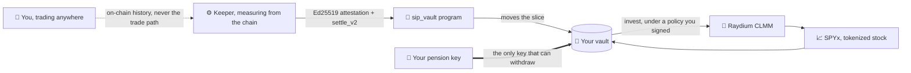

<div align="center">

<picture>
  <source media="(prefers-color-scheme: dark)" srcset="packages/website-oficial/public/logo/sip-mark-white.png">
  
</picture>

# SaverFi

### A pension you build one trade at a time.

**Every buy and every sell puts a slice into a vault only you can open — and that slice buys real tokenized stock.**<br>
No deposit. No decision to save. Trade where you already trade.

<br>

[](https://sip-website-oficial.vercel.app)
[](https://x.com/SaverFi)
[](https://solscan.io/account/6kA9H9zQT6PW5xWkXoAFCS3NotxarzaYqj66mjMf9w4J)


</div>

---

## The idea

People who trade every day rarely save. Not because they can't — because saving is a separate decision, made on a separate day, with money that already feels spent.

SaverFi removes the decision. You link the wallet you already trade with. After each trade, a slice — a share of the profit, or a share of the volume — is moved into a **vault that only your pension key can open**, and when enough has piled up, the vault buys the tokenized assets you chose.

You keep trading wherever you like. GMGN, Axiom, your own router — it makes no difference, because nothing sits in your execution path.

---

## It already happened on mainnet

Not a testnet, not a simulation. One real trade, measured, settled and invested by this code. Every line below is a link you can open right now.

| Step | What happened | Proof |
|---|---|---|
| **1. Vault created** | The owner's pension key signed the vault into existence | [`5EMtg7aY…`](https://solscan.io/tx/5EMtg7aYUG7fqN8h9heZ8Ht6dNbmKd1tYkkG7UTA19gMcFaSbG2kzKrs2YaEaiZiyevQ8KV9gojS7wKo1Rk3RVQd) |
| **2. Trading wallet linked** | A wallet bound to that vault, with its rate | [`55oN6Nxu…`](https://solscan.io/tx/55oN6NxuNViZZJ2g3VJDbu4Vgor2JiCntYqpW1aaZfEWddQxTSnTm7KenwPDXjFmAWzxZ8pLGBsEEZJo1sp2BqyV) |
| **3. The slice was taken** | `settle_v2` moved **0.036634582 SOL** out of the trading wallet and into the vault | [`2tE3BMTa…`](https://solscan.io/tx/2tE3BMTa6BPUmxaWvxDPEaK4piZ3KKL7pXGpmRHcUy6fHD2AK66rF6XnAKbNADKaarjSNGxTHqxqJpGFZ79vzvpy) |
| **4. The slice bought stock** | The vault wrapped, converted, and swapped through Raydium CLMM into **SPYx** | [`2YdLAtx…`](https://solscan.io/tx/2YdLAtxPYSUu4EJJrN9wiqXnPJhiWHEF3F9d14XoJAUD7X9qFLeQB64hmC6wmHbJoaVwCzd6zLzwXM3uux2c2MBw) |
| **5. And it is still there** | The vault holds **0.00692812 SPYx** today — an S&P 500 position paid for entirely by one trade's profit | [vault `EFXK995P…`](https://solscan.io/account/EFXK995PV49Qz8xPSYMEUDBU5AKRR466JkgsfuGak5iU) |

The keeper that did it is running right now and says so in public:

```bash
curl -s https://sip-solana-keeper-production.up.railway.app/status | jq '{mode, armed, sweeps, alerts}'
```

---

## How it works



**Nothing is in your execution path — on purpose.** A Privy policy can allow or deny a transaction, but it cannot add an instruction to one, and a router of ours would only ever see our own trades. So the slice is measured *after* the fact, from the chain itself, and collected by a signed settlement. That is what lets you trade anywhere and still save.

**The measurement is attested, not trusted.** The keeper signs an Ed25519 attestation of what it measured; the program verifies that signature against the attester named in its own on-chain config, checks a nonce and a frontier slot so no window is replayed or run backwards, clamps the result to the vault's maximum contribution, and refuses outright if the settlement would push the trading wallet below the reserve its owner set.

**The keeper is dry by default.** A dry run never even reads a signing secret. Moving money takes an explicit arming variable *and* a byte-exact confirmation sentence *and* the on-chain config naming the keeper's key — a conjunction it re-asks on every single sweep.

---

## What's on chain

The `sip_vault` program — [`6kA9H9zQT6PW5xWkXoAFCS3NotxarzaYqj66mjMf9w4J`](https://solscan.io/account/6kA9H9zQT6PW5xWkXoAFCS3NotxarzaYqj66mjMf9w4J) — is 17 instructions, 4 account types and 39 named errors.

<details>
<summary><b>The instruction set</b></summary>

| | |
|---|---|
| **Setting up** | `init_config` · `create_vault_v2` · `link_wallet` · `unlink_wallet` |
| **Saving** | `settle_v2` — the attested slice, the only way value enters a vault |
| **Investing** | `wrap_sol` · `convert` · `invest` — SOL → wSOL → USDC → the assets in your policy |
| **Your controls** | `set_policy_v2` · `set_invest_policy` · `withdraw` · `withdraw_token` |
| **Protocol** | `set_attester` · `set_keeper` · `set_protocol_paused` · `transfer_authority` · `accept_authority` |

Authority transfer is two-step — an offer, then an acceptance — so a mistyped address cannot orphan the protocol.

</details>

<details>
<summary><b>The two ways a vault measures</b></summary>

- **Realized profit** — a slice of what the trading made. The web offers **20 %**; the program accepts 2.01 % – 100 %.
- **Volume** — a slice of the size of every buy and sell, winning or losing. The web offers **2 %**; the program accepts 0.01 % – 2 %.

**Only profit vaults are offered today.** The keeper cannot yet measure volume from real trades, so the web greys that choice out and the build route refuses it. The program itself accepts either.

</details>

---

## The app

<div align="center">
  
  <br><i>The dashboard, shown here with the seeded sample data every visitor sees before connecting — labelled "Sample data" in the product itself, because an example must never wear a live badge.</i>
</div>

Connect a Solana wallet and every number is read from mainnet through the app's own routes: your vault, your policy, live pool prices, what the vault holds and what it has saved. Login is external wallets only — Phantom, Backpack, Solflare — with no embedded wallet and no custody.

---

## Roadmap

### ✅ Shipped

- [x] **`sip_vault` deployed on Solana mainnet** — 17 instructions, Ed25519-attested settlement, replay-proof nonces and frontier slot
- [x] **The full loop executed for real** — trade → measure → settle → wrap → convert → buy tokenized stock
- [x] **Keeper live on Railway** — armed, sweeping every 60 s, with public `/health` and `/status`
- [x] **Signing through a Privy server-wallet seat**, bounded by a policy that allows only this program's instructions
- [x] **Single-writer safety** — a Postgres advisory lock; the loser of a deploy handover demotes to dry run instead of double-settling
- [x] **Dry run by default** — no signing secret is read until armed with an exact sentence
- [x] **Web on Vercel** — landing, sample dashboard, live dashboard, `/wallets` vault screens, Solana routes
- [x] **Vault, link, policy and pause flows** signed in the browser by the pension key
- [x] **Live/Mock is a pure function** — sample data can never render with a live badge
- [x] **CSP, HSTS and frame-ancestors** pinned by a build check that fails the build on drift
- [x] **Secret redaction on every log line and every alert body**, including a net for key material no one registered
- [x] **The Docker image gates itself** — typecheck, the whole test suite, and a preflight that really constructs all four money-moving instructions
- [x] **Critical alerts to Telegram**, with delivery counted and reported on `/status`

### 🔨 In progress

- [ ] **Usage leaderboard** — the code shipped; the live database still needs its migration before it can serve a row
- [ ] **Volume mode end to end** — the program accepts it; the keeper cannot yet measure volume from real trades
- [ ] **SaverFi's own landing footage** — the hero still plays the reference template's clip from a third party's CDN
- [ ] **Settlement at scale** — proven n = 1; the next milestone is many wallets, many windows

### 🗺️ Next

- [ ] **Aggregator routing (Jupiter)** in place of the single-pool walk, opening the basket beyond one asset
- [ ] **User-set basket weights and contribution limits** in the dashboard
- [ ] **Import an existing trading wallet**, not only wallets created here
- [ ] **A published investable universe** — the full tokenized-stock catalogue, chosen per vault
- [ ] **Continuous integration** — the suites are green and nothing automatic runs them yet
- [ ] **Governance over the upgrade authority** — today a single key, no timelock

---

## Where it stands, honestly

A hackathon README that overclaims is worse than one that claims less, so:

- The money path is **proven once**, on 2026-09-19, for one wallet and one vault. It is real, and it is n = 1.
- The **leaderboard returns an error in production** until the live database gets the column the keeper writes.
- The landing's background video **belongs to the reference template**, not to SaverFi.
- The program is **upgradeable by a single team key** with no timelock. That is a beta posture, stated plainly.
- `withdraw` and `withdraw_token` are implemented and tested, but **have not yet been exercised on mainnet**.

---

## Run it yourself

> **Node 22.14.0 and pnpm 10.** On Node 20 the test suites fail to load before they run a single case.

```bash
pnpm install
pnpm dev          # the site on http://localhost:3002  (localhost, not 127.0.0.1)
pnpm typecheck    # solana-log, solana-core, solana-keeper and the web
pnpm test         # the same four packages
pnpm test:keeper  # the keeper alone
pnpm build        # the web's production build; prebuild runs check:csp and check:idl
```

The landing and the sample dashboard need **no environment and no keys**. Connecting, `/wallets` and the Solana routes read the variables in [`packages/website-oficial/.env.example`](packages/website-oficial/.env.example).

The program has its own toolchain: `pnpm --dir packages/solana-program test` runs `anchor test` against a local validator, deliberately outside `pnpm test`.

<details>
<summary><b>Repository layout</b></summary>

```
packages/solana-program   Anchor workspace: the sip-vault program and its IDL, plus toy-venue,
                          the venue its invest guards are tested against
packages/solana-core      the IDL codec the browser may load, and the server-only relay,
                          verifier and builders behind the web's Solana routes
packages/solana-keeper    discovers links, settles and invests; dry run by default
packages/solana-log       the redacting logger every service prints through
packages/website-oficial  the landing, the sample dashboard, the vault screens, the Solana routes
tools/landing-shot        regenerates the landing's screenshot of the dashboard
archive/evm               retired EVM code: not installed, built, tested or deployed
```

</details>

<details>
<summary><b>Operations</b></summary>

- [`docs/runbooks/RAILWAY_SOLANA.md`](docs/runbooks/RAILWAY_SOLANA.md) — deploying the keeper: every variable, which are secret, and a phased rollout
- [`docs/runbooks/VERCEL_WEB.md`](docs/runbooks/VERCEL_WEB.md) — deploying the web, and the Privy domain
- [`docs/runbooks/PRIVY_SOLANA.md`](docs/runbooks/PRIVY_SOLANA.md) — the signer seat, the policy that bounds it, and what that policy does *not* prevent
- [`docs/runbooks/SECRETS.md`](docs/runbooks/SECRETS.md) — which keys exist, where each lives, and how they stay out of chats and logs

The runbooks are written in Spanish.

</details>

<details>
<summary><b>About the name</b></summary>

The product is **SaverFi**. The code name is **SIP**: package names, environment variables, the `sip-vault` program and its signed domains all keep it. To find every remaining mention:

```bash
git grep -n -I -w SIP
```

`-w` is what makes it a word search, and it is the only form to use here.

Never `git grep -n -I -E '\bSIP\b'`: git's regex engine has no `\b`, so that pattern matches **nothing whatsoever** and hands back a silent all-clear on a repository full of the word. A test in the web package runs both forms against the real checkout and fails if the broken one is ever written down anywhere but here.

</details>

---

<div align="center">

**[Open the app](https://sip-website-oficial.vercel.app)** · **[@SaverFi](https://x.com/SaverFi)** · **[The program on Solscan](https://solscan.io/account/6kA9H9zQT6PW5xWkXoAFCS3NotxarzaYqj66mjMf9w4J)** · **[Keeper status](https://sip-solana-keeper-production.up.railway.app/status)**

<sub>Built on Solana. Beta — the program is upgradeable and the vault holds real value.</sub>

</div>
