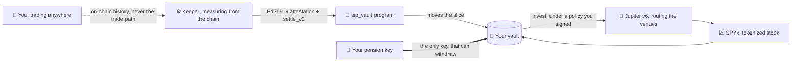
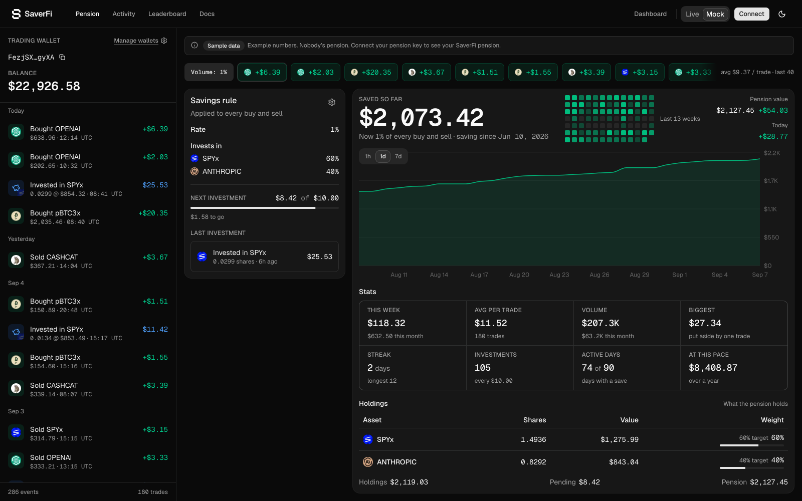

<div align="center">

<h1><a href="https://screen.studio/share/3qBq1Shw">→ VIDEO SHOWING HOW IT WORKS END TO END ←</a></h1>

<picture>
  <source media="(prefers-color-scheme: dark)" srcset="packages/website-oficial/public/logo/sip-mark-white.png">
  
</picture>

# SaverFi

### A pension you build one trade at a time.

**Every buy and every sell puts a slice into a vault only you can open — and that slice buys real tokenized stock.**<br>
No deposit. No decision to save. Trade where you already trade.

<br>

[](https://sip-website-oficial.vercel.app)
[](https://x.com/SaverFi)
[](https://solscan.io/account/6kA9H9zQT6PW5xWkXoAFCS3NotxarzaYqj66mjMf9w4J)


</div>

---

<div align="center">


<sub><b>A trade fills. A slice is put aside. The vault buys real tokenized stock — and only your key can open it.</b></sub>

</div>

---

## The idea

People who trade every day rarely save. Not because they can't — because saving is a separate decision, made on a separate day, with money that already feels spent.

SaverFi removes the decision. You link the wallet you already trade with. After each trade, a slice — a share of the profit, or a share of the volume — is moved into a **vault that only your pension key can open**, and when enough has piled up, the vault buys the tokenized assets you chose.

You keep trading wherever you like. GMGN, Axiom, your own router — it makes no difference, because nothing sits in your execution path.

---

## It already happened on mainnet

Not a testnet, not a simulation. Real trades, measured, settled and invested by this code. Every line below is a link you can open right now.

| Step | What happened | Proof |
|---|---|---|
| **1. Vault created** | The owner's pension key signed the vault into existence | [`5EMtg7aY…`](https://solscan.io/tx/5EMtg7aYUG7fqN8h9heZ8Ht6dNbmKd1tYkkG7UTA19gMcFaSbG2kzKrs2YaEaiZiyevQ8KV9gojS7wKo1Rk3RVQd) |
| **2. Trading wallet linked** | A wallet bound to that vault, with its rate | [`55oN6Nxu…`](https://solscan.io/tx/55oN6NxuNViZZJ2g3VJDbu4Vgor2JiCntYqpW1aaZfEWddQxTSnTm7KenwPDXjFmAWzxZ8pLGBsEEZJo1sp2BqyV) |
| **3. The slice was taken** | `settle_v2` moved **0.036634582 SOL** into the vault — exactly 20 % of the 0.183172913 SOL that trading session made | [`2tE3BMTa…`](https://solscan.io/tx/2tE3BMTa6BPUmxaWvxDPEaK4piZ3KKL7pXGpmRHcUy6fHD2AK66rF6XnAKbNADKaarjSNGxTHqxqJpGFZ79vzvpy) |
| **4. The slice bought stock** | The vault wrapped, converted, and swapped through Raydium CLMM into **SPYx** | [`2YdLAtx…`](https://solscan.io/tx/2YdLAtxPYSUu4EJJrN9wiqXnPJhiWHEF3F9d14XoJAUD7X9qFLeQB64hmC6wmHbJoaVwCzd6zLzwXM3uux2c2MBw) |
| **5. Then it bought again, through an aggregator** | On 2026-09-22 the owner re-signed the vault's policy onto **Jupiter v6**, and the vault wrapped, converted and bought SPYx through it — `invest` CPI'ing Jupiter, Jupiter routing Orca Whirlpool, Token-2022 settling the transfer | [`2KGe82ER…`](https://solscan.io/tx/2KGe82ERi3PJ8wJhXgHoLvMatvM4HhdUd5QrUU6TAPap4QdjdpfdnpCEqo77zRCpgJxSxck8G4z7hwbTmXUodL7S) |
| **6. Then a basket of two** | The owner signed SPYx + ANTHROPIC, and the next deposit bought **both legs**, each through Jupiter on its own venue — the first PreStocks leg this vault has held | [`2w5Uwo6X…`](https://solscan.io/tx/2w5Uwo6XonpG8s1epuoHtbPF7V5pnjNXDK6jch2k5pJDXmu9dyKYT1rFGFy9XiffTr7Lw8JZENfipYvXwF4h8SRS) · [`43S4uAxY…`](https://solscan.io/tx/43S4uAxYbAUQApfwBkybtG3DLMMeoXsPqrg3qYhTRWCiBqCnQTPupcwmYn7d6vtPf2TQ4gUHLCQcLnzT47LBh12C) |
| **7. And it saved again** | On 2026-09-23 a second trading session was settled: `settle_v2` moved **0.028372759 SOL** into the vault, at the 25 % rate the owner had signed from the live page that morning | [`5nGb2hqz…`](https://solscan.io/tx/5nGb2hqzdwko4ocpPvKaUKFZ7qnhpVET9Kf9xoVvtM4c1K5wVxgXP19CjoXZg1bTdjRmuryXqisiDSokR3953zc6) |
| **8. Then it switched to volume** | On 2026-09-25 the owner's pension key signed `set_policy_v2`, moving the vault from 25 % of profit to **1 % of every buy and every sell** | [`4iyqFNcx…`](https://solscan.io/tx/4iyqFNcx1N6dGPX8sGQGiiDcEdYqwUxRYuNnFQBiiprCWinkXCJBNRLzMGBVzbADt547YK2nxgp6ECzxFuXeo5Ki) |
| **9. And saved on volume** | Minutes later, three `settle_v2` in volume mode moved **0.043755651 SOL** into the vault — 1 % of the 4.375565225 SOL the owner's next five trades bought and sold — and the vault converted it to USDC | [`5JYcviq5…`](https://solscan.io/tx/5JYcviq52S49mXuHT3iVi9ritB55uyLcjcvLk2xUXYCVgsEG3q8HdmQuHJsBr6irwBxG8aqvfRjbGzAjMCLaWHxT) · [`3NwEBhhy…`](https://solscan.io/tx/3NwEBhhy426ABfpqb9CHwap3GNBsHXkjQr4e94H6LmhUPKvACz5i2cyWM1YR5YK6Nct6TQsyJtCJ6s4o2bjuvqoS) · [`2u5bR3CL…`](https://solscan.io/tx/2u5bR3CLCvMQCE8M2JbY5uiztsmLBmzJR4tD7qqSSQHZQXJoVVs7mSbvuFdV5nMYJiLf7d5iR34EZw4LBJNUpTEB) |
| **10. And the volume savings bought stock** | A fourth volume `settle_v2` moved **0.02215709 SOL** in; converted, it took the vault's USDC past the basket's $10, and the keeper bought SPYx with 5.34 USDC | [`4LunSyrb…`](https://solscan.io/tx/4LunSyrbytTC4MegKqgzoQa4SYUV7KxGTbUxRe72yzzEYv7MkA7Ejr4zpiuRKbtxjYknmRndJ6U8i5Y134zFDrm9) · [`3Cs1H6SH…`](https://solscan.io/tx/3Cs1H6SH4QA6SGvaCYNdsjKZanUggLQyG4dbQ38qGdtJVhW8itHEVkeQt2sF26uMXihdjW3WtpV3j1yiqM5L4Nub) |
| **11. Then back to profit, and a full basket** | The owner's pension key moved the vault back to **20 % of profit**; two profit settlements followed, and with 6 USDC the owner sent in, the keeper bought **both legs**, SPYx and ANTHROPIC, 6.35 USDC each | [`67MZSaEr…`](https://solscan.io/tx/67MZSaErMKs3AV5UnFrTRVgRJf7SCayqqHakNpEFPYyXXC9TYC5JP6gVcJ4bDFWpqkS253cuFqyz6iYu4zg4i9Aa) · [`4Tsc7BXQ…`](https://solscan.io/tx/4Tsc7BXQdUZ564znbi42ZEEy6cUeqbHq8LcRpPRJX5zmowLku1Tsp4FGhCstqf6nmdKUbiCHKyFD5ANhws5A7BEv) · [`63AQuFBU…`](https://solscan.io/tx/63AQuFBU9z2aGak2ey7B4e14iwfkQGiTXWxbYFfWwKffxjXNEX6Wqc67LoyWm4fymEGzLF221ZH2F26Kfu8tsEfr) |
| **12. And it is still there** | On 2026-09-26 the vault holds **0.0443 SPYx** and **0.0172 ANTHROPIC** (PreStocks) — positions paid for by trading profit, trading volume and the owner's own test deposits — plus **2.69 USDC** waiting for the next buy | [vault `EFXK995P…`](https://solscan.io/account/EFXK995PV49Qz8xPSYMEUDBU5AKRR466JkgsfuGak5iU) |
| **13. And it comes back out** | On 2026-10-06 the owner's pension key took **0.004312315 ANTHROPIC** out of the vault with `withdraw_token` — the first time money has left a SaverFi vault, signed by the only key that can make it leave | [`5GMPTgTg…`](https://solscan.io/tx/5GMPTgTgipXbt6T3RKHMFwvkhRhGR8npodrSJNSFSXtAcoBdeQS4T5SUqKizRVd1zGFsxcDP7up5Ke2VPrzNp2wc) |

The keepers that did it — one settles profit vaults and invests every vault, the other settles volume vaults — are running right now and say so in public:

```bash
curl -s https://sip-solana-keeper-production.up.railway.app/status | jq '{role, mode, armed, sweeps, alerts}'
curl -s https://sip-solana-volume-keeper-production.up.railway.app/status | jq '{role, mode, armed, sweeps, alerts}'
```

---

## How it works


```mermaid
flowchart LR
    T["🧑 You, trading anywhere"]
    K["⚙️ Keeper, measuring from the chain"]
    P["📜 sip_vault program"]
    V[("🏦 Your vault")]
    R["🔁 Jupiter v6, routing the venues"]
    S["📈 SPYx, tokenized stock"]
    O["🔑 Your pension key"]

    T -. "on-chain history, never the trade path" .-> K
    K -- "Ed25519 attestation + settle_v2" --> P
    P -- "moves the slice" --> V
    V -- "invest, under a policy you signed" --> R
    R --> S
    S --> V
    O == "the only key that can withdraw" ==> V
```

**Nothing is in your execution path — on purpose.** A Privy policy can allow or deny a transaction, but it cannot add an instruction to one, and a router of ours would only ever see our own trades. So the slice is measured *after* the fact, from the chain itself, and collected by a signed settlement. That is what lets you trade anywhere and still save.

**The measurement is attested, not trusted.** The keeper signs an Ed25519 attestation of what it measured; the program verifies that signature against the attester named in its own on-chain config, checks a nonce and a frontier slot so no window is replayed or run backwards, clamps the result to the vault's maximum contribution, and refuses outright if the settlement would push the trading wallet below the reserve its owner set.

**The venue is yours, and it is pinned.** `invest` will only CPI the program named in the policy you signed, byte for byte. The keeper cannot route anywhere else, and the day it learns a new venue, the only way that venue reaches your vault is you signing for it.

**Linking a wallet takes a third signature.** Not just the owner's and the wallet's on the transaction — the wallet also signs a separate 140-byte consent naming this program, this wallet, this vault and this owner, which the program verifies before it will bind anything. It matters because a Privy policy for a custom program can only match the program id: a seat allowed to sign `settle_v2` is also allowed to sign `link_wallet`, and could otherwise bind a fresh wallet to a stranger's vault. What that seat cannot do is sign a *message*. The consent starts with the byte `0xFF`, which no Solana transaction can begin with, so those bytes can never be replayed as one.

**The keeper is dry by default.** A dry run never even reads a signing secret. Moving money takes an explicit arming variable *and* a byte-exact confirmation sentence *and* the on-chain config naming the keeper's key — a conjunction it re-asks on every single sweep.

---

## What's on chain

The `sip_vault` program — [`6kA9H9zQT6PW5xWkXoAFCS3NotxarzaYqj66mjMf9w4J`](https://solscan.io/account/6kA9H9zQT6PW5xWkXoAFCS3NotxarzaYqj66mjMf9w4J) — is 17 instructions, 4 account types and 39 named errors.

**The bytes running on mainnet are the bytes this repository tests.** Not "built from this source" — the same file. Check it yourself:

```bash
solana program dump 6kA9H9zQT6PW5xWkXoAFCS3NotxarzaYqj66mjMf9w4J /tmp/sip_vault.so -u mainnet-beta
shasum -a 256 /tmp/sip_vault.so
# 60e94348d7cf841ac4542b356ed1719047c33256a96894e3a12bdf32c63de823
# …identical to packages/solana-program/target/deploy/sip_vault.so, and to the
#   hash the keeper's local-validator tests pin their run against.
```

<details>
<summary><b>The instruction set</b></summary>

| | |
|---|---|
| **Setting up** | `init_config` · `create_vault_v2` · `link_wallet` · `unlink_wallet` |
| **Saving** | `settle_v2` — the attested slice, the only way value enters a vault |
| **Investing** | `wrap_sol` · `convert` · `invest` — SOL → wSOL → USDC → the assets in your policy |
| **Your controls** | `set_policy_v2` · `set_invest_policy` · `withdraw` · `withdraw_token` |
| **Protocol** | `set_attester` · `set_keeper` · `set_protocol_paused` · `transfer_authority` · `accept_authority` |

Authority transfer is two-step — an offer, then an acceptance — so a mistyped address cannot orphan the protocol.

</details>

<details>
<summary><b>The two ways a vault measures</b></summary>

- **Realized profit** — a slice of what the trading made. The web starts at **20 %** and the owner can change it from the live page; the program accepts 2.01 % – 100 %.
- **Volume** — a slice of the size of every buy and every sell, winning or losing, so a round trip is charged on both legs. The web starts at **1 %**, with 0.5, 1 and 2 % presets; the program accepts 0.01 % – 2 %.

**Both have been offered since 2026-09-25.** A vault moves between them with one `set_policy_v2` signed by the pension key, from *Vault settings* (the gear on the Savings rule card); a new vault can start on Volume from the vault card, while the first-run setup still starts every vault on Profit. Each mode is settled by its own keeper service.

A transaction counts as volume when the trading wallet signed it, it succeeded, it is not a plain transfer or one of SaverFi's own settlements, and the wallet's SOL (wrapped SOL included) moved one way while another token moved the other. Its size is how far the wallet's SOL moved, not counting the network fee or the rent of the wallet's token accounts opened or closed. Wrapping, unwrapping, transfers and failed swaps never count. Only SOL is measured, so a swap with no SOL leg, such as USDC into a token, counts just the SOL the wallet pays beside it, such as a tip — a gap that can only charge less, never more. A volume slice settles once it owes 0.001 SOL, or an hour after its oldest trade. Trades made before a switch to Volume, or before a change of its rate, are forgiven rather than charged at the new rule.

</details>

---

## The app

<div align="center">
  
  <br><i>The dashboard, shown here with the seeded sample data every visitor sees before connecting — labelled "Sample data" in the product itself, because an example must never wear a live badge.</i>
</div>

Connect a Solana wallet and every number is read from mainnet through the app's own routes: your vault, your policy, live pool prices, what the vault holds and what it has saved. Login is external wallets only — Phantom, Backpack, Solflare — with no embedded wallet and no custody.

---

## Latest update

The newest day of the [changelog](CHANGELOG.md), copied here each morning. Every earlier day is in the full file.

<!-- latest-changelog:start -->
<details>
<summary><b>2026-10-08</b> — A landing of SaverFi's own, and importing a wallet you already trade with, first one linked on mainnet (partial)</summary>

<br>

**Landing**

A new landing, built overnight at the owner's request, one step after another; all of it is in
production at [`/welcome`](https://sip-website-oficial.vercel.app/welcome).

- **It opens on SaverFi's own logo** `c9194fd`. The green build of the S from the launch film
  plays, then the S flies into the navigation bar and the page enters in pieces — headline line
  by line, buttons one after another, the frame from below. It can be skipped with a click or a
  key, and with reduced motion it is a still frame. It only counts as seen if it really was: a
  slow or failed start no longer uses it up `7de9942`. At first it played once per browser tab;
  by the morning it was remembered for five minutes per browser instead, so a quick reload is
  fast and a later visit, or a return from the app, sees it again `0ad9718`.
- **The frame shows the app itself**: an eight-second loop of the sample dashboard, ending on
  the same picture the visitor gets on scrolling in. The owner chose to re-seed the sample to
  look like the real product — a SPYx 60 / ANTHROPIC 40 basket, Volume at 1 %, a $10 threshold
  — and the README's screenshot is now that same capture.
- **The reference template's footage is gone** `9f23adf`. The background used to be a third
  party's clip, another brand's card, served from that party's CDN. It is now the grid the S is
  built on, drawn in code; the owner picked it over an aurora after seeing both on the real
  page. Every video the site plays is now its own, and the content security policy allows media
  from the site alone.
- **The background comes alive on wide screens** `7de9942` `ecc8670`. The owner asked for
  activity on the grid while there are no users yet: cards of example savings and buys appear
  beside the frame, fed by a line from the Axiom, GMGN and Photon terminals, with a large faint
  S and floating SPYx, ANTHROPIC, SOL and USDC logos behind. At the owner's request the cards no
  longer say "Example" and carry no address or time — they say what a trade does, not who made
  it — while the frame still reads "Example — nobody's pension". Only at 1024 px and wider, never
  with reduced motion.
- **Simpler words** `ecc8670`. The owner asked for a summary that is easier to read: "Trade as
  usual and grow your own onchain pension", and a shorter beta line that still says the team
  can update the SaverFi program, because it is true.
- **Every button goes where it says** `7160b30`. Connect connects and, once the login succeeds,
  goes straight into the app — the pension, or the setup if there is no vault yet; before, it
  stayed on the landing. A visitor already connected sees "Open my pension". "See the app" and
  scrolling open the sample; Leaderboard and Dashboard are plain links, and the bar reads
  "Leaderboard · See the app · Dashboard │ Connect". A deployment without the login provider's
  configuration no longer breaks the landing. The full login-then-pension path is tested only
  against the development stand-in for Privy; on production, Connect was checked as far as
  opening the real wallet dialog.
- **Without a wallet, Live is the landing** `609d701`. The owner's decision: a visitor with no
  wallet who asks for Live — `/?mode=live`, `/activity`, the Live button on the sample, or
  Disconnect — lands on the landing at `/`, and the "Connect your pension key" card is gone.
  With a wallet connected, Live goes straight into the pension and never passes through the
  landing, even when the "already connected" cookie has expired. `/?mode=mock` is still the
  sample, and `/welcome` never moves. Checked on production as a visitor; the connected path is
  tested only against the development stand-in for Privy. At first the Disconnect inside the
  wallets modal only signed out and left a visitor on the sample; at the owner's request it now
  lands on the landing too `0e0bc48`.

**Wallet import**

- **Bring a wallet you already trade with** `981d427` `a79be6e`. The owner asked for it at
  03:10, from the roadmap; by 05:32 "Import a wallet I already use" sat under Create on the
  trading-wallets card and in the live panel's next step. The private key is pasted into a
  masked field that never enters the page's state and is cleared on every refusal; the page
  derives the address from the key itself and refuses a damaged one. Before the key goes
  anywhere, the server reads the address on chain and refuses a key that owns a vault, holds a
  role in the protocol, or is linked to another vault. Privy then imports it with the keeper's
  seat and policy in the same call, the page reads back that the seat is there, and links it to
  the vault the usual way. Imported rows can have SaverFi's permission removed again.
- **The owner's decisions on it**: a wallet that already holds tokens other than SOL must have a
  box ticked first, because selling them later counts as profit; no special warning for keys of
  Telegram trading bots. The card no longer says the permission is "bounded to moving SOL into
  your vault" — it now says what the policy allows: SaverFi program transactions only.
- **First real import, linked on mainnet.** At 04:42 UTC a fourth wallet was linked to the
  owner's vault ([`dXz3F1L3…`](https://solscan.io/tx/dXz3F1L3xP4F3aLC6hNwjf1zCC5XvCDGXbvXeu7XQE6zT4imAoN8AENyTEyE7v8G1C2upYV35EVto8RDvjjmwR4)),
  and the keeper reports all four wallets signable through its Privy seat. Nothing has been
  settled from it yet. It showed that Privy numbers an imported wallet 0, like the first created
  one, so the two were both called "Trading wallet 1"; imported wallets are now named and
  ordered on their own, and Create explains why it is disabled on an account whose only Privy
  wallets are imported `ada9339`.
- **An audit before calling it done** `01f1a6f` `0fbbaa7`: a multi-agent review confirmed 14
  findings, none critical or high. The largest: the import check would read any address's whole
  token list into memory, so a wallet with thousands of accounts could swell the server; the
  list now has its own capped read and names at most eight holdings. The panel now also says
  plainly that SOL coming back by anything other than a plain transfer — an unstake, a lending
  or perps exit — counts as profit, and that once imported the wallet can also be used and
  exported from the SaverFi account. One finding is left to the owner, since fixing it means
  touching the keeper: a SOL deposit whose transaction also calls another program, such as an
  exchange withdrawal with a memo, counts as profit for every wallet.
- **An unanswered read is "unreadable", never "missing"** `b27f48f`. A chain read that came back
  without a result used to look like a vault that does not exist, so the page could offer to
  create a vault that may already be there. The same fix covers links, policies and balances.

**Keeper**

- **The doorbell rang again.** The new link at 04:42 UTC was its first event since the restart
  of the 7th, and the profit keeper trusts it again. Its webhook sync still fails (323 times in a
  row at 10:14 UTC), so with four wallets every sweep is still a full pass.

</details>
<!-- latest-changelog:end -->

---

## Roadmap

### ✅ Shipped

- [x] **`sip_vault` deployed on Solana mainnet** — 17 instructions, Ed25519-attested settlement, replay-proof nonces and frontier slot
- [x] **The full loop executed for real** — trade → measure → settle → wrap → convert → buy tokenized stock
- [x] **Keeper live on Railway** — armed, sweeping every 60 s, with public `/health` and `/status`, which also report what each sweep costs: duration p50/p90, skipped sweeps, per-phase timings and which RPC endpoint is answering
- [x] **Signing through a Privy server-wallet seat**, bounded by a policy that allows only this program's instructions
- [x] **Single-writer safety** — a Postgres advisory lock; the loser of a deploy handover demotes to dry run instead of double-settling
- [x] **Dry run by default** — no signing secret is read until armed with an exact sentence
- [x] **Web on Vercel** — landing, sample dashboard, live dashboard, `/wallets` vault screens, the all-pensions `/dashboard`, Solana routes
- [x] **Vault, link, policy and pause flows** signed in the browser by the pension key
- [x] **Live/Mock is a pure function** — sample data can never render with a live badge
- [x] **CSP, HSTS and frame-ancestors** pinned by a build check that fails the build on drift
- [x] **Secret redaction on every log line and every alert body**, including a net for key material no one registered
- [x] **The Docker image gates itself** — typecheck, the whole test suite, and a preflight that really constructs all four money-moving instructions
- [x] **Critical alerts to Telegram**, with delivery counted and reported on `/status`
- [x] **[Usage leaderboard](https://sip-website-oficial.vercel.app/leaderboard)** — points come from showing up (participation and streak), with the size term capped and logarithmic, so a large wallet cannot buy the top spot
- [x] **Aggregator routing through Jupiter v6** — the single-pool walk is gone. Proven on mainnet 2026-09-22: `convert` and `invest` both CPI Jupiter, which routed Orca Whirlpool into SPYx. The routes need address lookup tables to fit a packet at all, so the keeper compiles a v0 transaction when there are tables and the legacy one when there are not
- [x] **The owner picks the basket and the limits** — a picker for 1–5 stocks and their shares (the program takes up to 8), the minimum per stock, the per-settlement cap and the venue, all signed in the browser, and editable after the first signature. A two-stock basket (SPYx + ANTHROPIC) signed this way bought both its legs on mainnet on 2026-09-22
- [x] **A first-run setup for a new pension key** — a key with no vault is walked through two steps: what SaverFi does, then create the vault, choosing how much of each gain to keep (5–50 %) and whether the savings stay in SOL or buy stocks. The vault takes one signature; linking a trading wallet follows on the dashboard, and if stocks were chosen, buying them is asked for once the first savings arrive (in the same browser). Live on the site since 2026-09-24, checked in the production build. Two more pension keys have created vaults on mainnet since, on 2026-09-30 and on 2026-10-02; whether they came through this setup is not recorded
- [x] **The vault's rule is changed from the live page itself** — since 2026-09-25 a gear on the Savings rule card opens *Vault settings*: profit or volume and its rate, pause, the basket and its threshold, with a "?" on every title that explains it. Every change is signed by the pension key — `set_policy_v2` for how the vault saves, `set_invest_policy` for what it buys. Proven on mainnet 2026-09-23, when the owner's vault went from 20 % to 25 % of profit from the rule card
- [x] **Volume mode, live on mainnet** — a second keeper service settles volume vaults, and the web offers Volume to every vault, starting at 1 %; the activity rows say "1 % of $X in buys and sells". Proven on mainnet 2026-09-25: after the owner switched the vault to 1 % of volume, three `settle_v2` in volume mode saved 0.043755651 SOL from five real trades, and a fourth that evening took the vault's USDC past its basket's threshold and into a SPYx buy. Live on the site, checked in the production build. So far one vault and one wallet, which went back to profit the same evening, so no vault saves on volume today
- [x] **Money comes back out** — `withdraw_token`, signed by the pension key alone, took 0.004312315 ANTHROPIC out of the owner's vault on mainnet on 2026-10-06 ([`5GMPTgTg…`](https://solscan.io/tx/5GMPTgTgipXbt6T3RKHMFwvkhRhGR8npodrSJNSFSXtAcoBdeQS4T5SUqKizRVd1zGFsxcDP7up5Ke2VPrzNp2wc)). The plain SOL `withdraw` has not been used on mainnet yet
- [x] **[A public dashboard of every pension](https://sip-website-oficial.vercel.app/dashboard)** — since 2026-10-07: what all vaults have saved, traded and invested, by day, by mode and by asset, read from the keeper's `stats` block (live, it matched the leaderboard to the lamport). A labelled sample in Mock; in Live, anything it could not read shows as "—", never as 0. Today its numbers are one vault's, since the other two have not saved yet
- [x] **[A landing of SaverFi's own](https://sip-website-oficial.vercel.app/welcome)** — since 2026-10-08: it opens on the logo from the launch film, the background is the S's grid drawn in code with example activity on wide screens, and the frame plays a loop of the app. The reference template's clip from a third party's CDN is gone; every video is served by the site itself. Connect goes straight into your pension, or into the setup if you have no vault yet. Without a wallet, Live is the landing; with one, it goes straight to your pension. The connected paths are tested against a development stand-in for the login provider, not with a real wallet on production
- [x] **Import a wallet you already trade with** — since 2026-10-08, beside Create: paste its private key, the page checks the address on chain first (a key that owns a vault, holds a protocol role or is linked elsewhere is refused), and Privy imports it with the keeper's seat and links it to your vault. The first one was linked to the owner's vault on mainnet that morning ([`dXz3F1L3…`](https://solscan.io/tx/dXz3F1L3xP4F3aLC6hNwjf1zCC5XvCDGXbvXeu7XQE6zT4imAoN8AENyTEyE7v8G1C2upYV35EVto8RDvjjmwR4)), and the keeper reports it signable. Nothing has been settled from an imported wallet yet
- [x] **[Public prices, no wallet needed](https://sip-website-oficial.vercel.app/prices/view)** — `/prices` answers JSON and `/prices/view` is the page for a reader: the SOL pool beside Pyth's on-chain account and beside Pyth's Hermes service, with the drift between the two; SPYx beside Pyth's own feed; ANTHROPIC beside PreStocks' own API, with the fee in force. Every figure carries its age or source. Checked live on 2026-09-26

### 🔨 In progress

- [ ] **Polishing volume in the web** — it settles and converts on mainnet, and the owner is still refining how it reads; for now a settlement row does not say how many trades it covered or split the buy from the sell, and the first-run setup offers Profit only
- [ ] **Only check the wallets that moved** — a Helius webhook rings the keeper when a linked wallet or vault transacts, so each sweep turns only those, plus a safety rotation that still reaches everyone within 30 minutes. Built, deployed and switched on 2026-09-23, on the profit keeper only. On 2026-09-25 it earned the keeper's trust: between a restart at 17:30 UTC and 17:56 it received 16 events, none rejected and no misses detected. It starts untrusted after every restart until its first event; the deploy at 18:38 UTC reset it, and by 2026-09-26 it was trusted again, with 21 events received, none rejected and no misses. Since 2026-10-02 its webhook sync reports that Helius did not keep the keeper's last edit of the webhook's address list; after the restart of 2026-10-07 at 01:54 UTC it failed again and the doorbell stayed silent until a new wallet was linked at 04:42 UTC on 2026-10-08; that event made it trusted again, while the sync was still failing (323 times in a row at 10:14 UTC). Below 50 linked wallets its safety rotation turns every wallet on every sweep anyway, so today every sweep is still a full pass
- [ ] **Settlement at scale** — proven nine times for one wallet, five at profit and four at volume; the next milestone is many wallets, many windows. A bench that boots the real keeper against a fake chain now measures how many wallets one sweep can carry, so that number is measured rather than guessed
- [ ] **Widening the shelf** — nine tokenized assets are catalogued and read on mainnet, each admitted or refused by six dated rules. Two clear every rule today; the rest are refused in public, with the reading that failed them

### 🗺️ Next

- [ ] **Price anchoring for the stock legs** — the SOL hop is anchored to Pyth; a stock leg's only bound today is the floor its owner signed once, which drifts
- [ ] **Continuous integration** — the suites are green and nothing automatic runs them yet
- [ ] **Governance over the upgrade authority** — today a single key, no timelock

---

## Where it stands, honestly

A hackathon README that overclaims is worse than one that claims less, so:

- The money path is proven for **one wallet and one vault**. The settlement half has run **nine times**, for 0.186381968 SOL in total — the vault's on-chain `lifetime_saved`: five times at profit (2026-09-19, 2026-09-23 and three on 2026-09-25) and four times at volume on 2026-09-25, between 17:45 and 19:38 UTC. The investing half has filled several times, including through Jupiter and into a two-stock basket on 2026-09-22 and again on 2026-09-25, with USDC that included the volume savings. Most of what the vault has received came from the owner's own test deposits (0.164 SOL and 14.1 USDC), not from settlement. It is real, and it is one wallet: on 2026-10-02 the program holds three vaults, but the other two — created by two other pension keys on 2026-09-30 and 2026-10-02, each with one trading wallet linked and no investment policy signed — have not had anything settled into them yet — and since the owner moved it back to profit at 19:41 UTC on 2026-09-25, no vault saves on volume.
- **Two keeper services, one per mode.** The profit keeper settles profit vaults and invests every vault's savings, volume vaults' included; the volume keeper settles volume vaults and never invests. They are built from the same keeper package, a role setting picks which mode each one settles, each runs under its own lock, and both sign with the same key — the one the program's configuration names as both its attester and its keeper. Each sweeps its wallets one after another, once a minute. The webhook "doorbell" meant to limit a sweep to the wallets that moved runs on the profit keeper only, and below 50 linked wallets its safety rotation still turns every wallet each sweep, so today both keepers do a full pass every sweep. Since 2026-10-02, when a third wallet was linked, the profit keeper has reported that Helius did not keep its last edit of the webhook's address list (4,982 failures in a row on 2026-10-05, and again after the restart of 2026-10-07), and between 2026-09-26 and 2026-10-08 the doorbell did not ring; it rang once on 2026-10-08, for a new link, with the sync still failing. The full pass still reaches every linked wallet, but the doorbell will need that fixed before it can narrow a sweep. A bench run on a laptop (not on Railway), made before the split, puts one keeper's ceiling at **at most ~97 linked wallets** at the public RPC's latency when 2 % of them trade in a given minute, and fewer as more of them do (54 at 20 %); the volume keeper's own ceiling has not been measured. A push to `main` redeploys the profit keeper but not the volume keeper: on 2026-10-07 the volume keeper was still the process started on 2026-09-25, running that day's code. Faster RPC raises it only as far as the provider plan's requests per second allow, and nothing outside the process polls `/health` yet, so a stalled keeper would not page anyone. Each sweep finds its wallets with one unpaginated `getProgramAccounts` call; on 2026-09-27 the RPC provider refused it as overloaded, the keeper's own Telegram alert fired, and the sweeps recovered by themselves, but that call will need paginating as the program grows.
- **Volume is measured in SOL.** A swap with no SOL or wrapped-SOL leg (USDC into a token, one token into another) counts only the SOL the wallet pays beside it, such as a tip, and a buy and a sell of one token inside a single transaction count at most their net SOL change, not both legs. Each settlement still moves at most the vault's cap — 0.06 SOL by default, which at 1 % is 6 SOL of trading in one settlement — and anything owed above it is not carried over. Switching *to* Volume forgives what the profit rule had not yet charged; switching back has no such boundary, so a volume-era trade still unsettled at that moment is measured as profit.
- **The keeper routes Jupiter v6 and nothing else.** Raydium CLMM is retired by name, so a vault whose signed policy still points at it refuses every sweep — loudly, before any SOL is wrapped — until its owner re-signs. Adding a venue is an entry plus a route builder, not a configuration change.
- **Two of the nine catalogued assets are offerable today.** The other seven are refused by the catalogue's own rules — a fee over the ceiling, a venue too thin for the reference leg, a floor source too small to be a price, or a recent failure still inside its quarantine window.
- **Profit mode counts SOL that did not come from a plain transfer as profit.** A SOL deposit whose transaction also calls a program outside the plain-transfer set (System, ComputeBudget, Ed25519, SPL Memo) and SaverFi's own — a bridge's, say — or SOL coming back from staking, lending or perps counts as gain. A plain transfer that carries a memo, as some services send their payouts, counts as a deposit. The import panel warns about the rest; the keeper does not tell these apart yet.
- A stock leg has **no independent price anchor**. The depth gate measures depth at the size of the turn and has no opinion about price; Pyth anchors the SOL hop alone; the only price bound on a stock leg is the floor its owner signed, which is derived once and then stands.
- The landing's moving background shows **example activity**, not real users: the cards are invented to show what a trade does, and the frame says "Example — nobody's pension".
- The program is **upgradeable by a single team key** with no timelock. That is a beta posture, stated plainly.
- `withdraw_token` was exercised on mainnet for the first time on 2026-10-06, when the owner took 0.004312315 ANTHROPIC out of the vault ([`5GMPTgTg…`](https://solscan.io/tx/5GMPTgTgipXbt6T3RKHMFwvkhRhGR8npodrSJNSFSXtAcoBdeQS4T5SUqKizRVd1zGFsxcDP7up5Ke2VPrzNp2wc)). The plain SOL `withdraw` is implemented and tested, but **has not yet been exercised on mainnet**.

---

## Run it yourself

> **Node 22.14.0 and pnpm 10.** On Node 20 the test suites fail to load before they run a single case.

```bash
pnpm install
pnpm dev          # the site on http://localhost:3002  (localhost, not 127.0.0.1)
pnpm typecheck    # solana-log, solana-core, solana-keeper and the web
pnpm test         # the same four packages
pnpm test:keeper  # the keeper alone
pnpm build        # the web's production build; prebuild runs check:csp and check:idl
```

The landing and the sample dashboard need **no environment and no keys**. Connecting, `/wallets` and the Solana routes read the variables in [`packages/website-oficial/.env.example`](packages/website-oficial/.env.example).

The program has its own toolchain: `pnpm --dir packages/solana-program test` runs `anchor test` against a local validator, deliberately outside `pnpm test`.

A green run is not by itself evidence. Two bugs here passed the whole suite for weeks, both for the same reason — a fixture that randomised the very field in dispute: [`docs/TESTING_TRAPS.md`](docs/TESTING_TRAPS.md).

<details>
<summary><b>Repository layout</b></summary>

```
packages/solana-program   Anchor workspace: the sip-vault program and its IDL, plus toy-venue,
                          the venue its invest guards are tested against
packages/solana-core      the IDL codec the browser may load, and the server-only relay,
                          verifier and builders behind the web's Solana routes
packages/solana-keeper    discovers links, settles and invests; dry run by default
packages/solana-log       the redacting logger every service prints through
packages/website-oficial  the landing, the sample dashboard, the vault screens, the Solana routes
tools/landing-shot        regenerates the landing's screenshot of the dashboard
archive/evm               retired EVM code: not installed, built, tested or deployed
```

</details>

<details>
<summary><b>Operations</b></summary>

- [`docs/runbooks/RAILWAY_SOLANA.md`](docs/runbooks/RAILWAY_SOLANA.md) — deploying the keeper: every variable, which are secret, and a phased rollout
- [`docs/runbooks/VERCEL_WEB.md`](docs/runbooks/VERCEL_WEB.md) — deploying the web, and the Privy domain
- [`docs/runbooks/PRIVY_SOLANA.md`](docs/runbooks/PRIVY_SOLANA.md) — the signer seat, the policy that bounds it, and what that policy does *not* prevent
- [`docs/runbooks/SECRETS.md`](docs/runbooks/SECRETS.md) — which keys exist, where each lives, and how they stay out of chats and logs

The runbooks are written in Spanish.

</details>

<details>
<summary><b>About the name</b></summary>

The product is **SaverFi**. The code name is **SIP**: package names, environment variables, the `sip-vault` program and its signed domains all keep it. To find every remaining mention:

```bash
git grep -n -I -w SIP
```

`-w` is what makes it a word search, and it is the only form to use here.

Never `git grep -n -I -E '\bSIP\b'`: git's regex engine has no `\b`, so that pattern matches **nothing whatsoever** and hands back a silent all-clear on a repository full of the word. A test in the web package runs both forms against the real checkout and fails if the broken one is ever written down anywhere but here.

</details>

---

<div align="center">

**[Open the app](https://sip-website-oficial.vercel.app)** · **[Leaderboard](https://sip-website-oficial.vercel.app/leaderboard)** · **[@SaverFi](https://x.com/SaverFi)** · **[The program on Solscan](https://solscan.io/account/6kA9H9zQT6PW5xWkXoAFCS3NotxarzaYqj66mjMf9w4J)** · **[Keeper status](https://sip-solana-keeper-production.up.railway.app/status)**

<sub>Built on Solana. Beta — the program is upgradeable and the vault holds real value.</sub>

</div>
