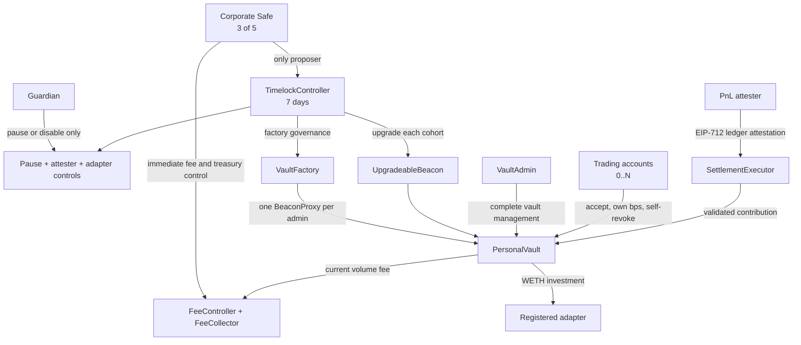

# Contract architecture

## Status and scope

This document describes the contracts currently in this repository. It is not
a deployment record: for the live canary topology on Robinhood mainnet see the
[mainnet settlement results](../canary/MAINNET_SETTLEMENT_RESULTS.md). The only
investment adapter included in the repository is still a local mock, and no
adapter is registered on any live deployment.

Note for anything that reasons about block numbers: on Robinhood Chain
`block.number` returns the **L1** block number, not the L2 number that
`eth_blockNumber` and every log carries. `activationBlock` and the attested
settlement range are therefore in L1 space.

The product model is one persistent vault address controlled by one
`VaultAdmin` at a time, with any number of independently configured trading
accounts. "Persistent" means that the contract has no close operation or
expiry. It does not mean locked funds: the current admin can withdraw assets or
transfer administration.

## Identity and permanence

- `VaultFactory` permits one registered vault for an admin at a time.
- The vault is a CREATE2 `BeaconProxy`. Its ID includes the chain, factory,
  creating admin, and user salt; trading accounts are deliberately absent.
- A two-step admin transfer preserves the vault address and moves the factory
  registry entry to the new admin. The previous admin is no longer associated
  with that vault. An outstanding offer can be retracted by proposing the zero
  address; offers do not expire on their own.
- Ownership of the factory, both fee contracts, and every guardian-owned
  registry cannot be renounced. Each renunciation would be a one-step
  irreversible freeze of a surface whose only reversal path is the owner.
- Direct or relayed creation, explicit invalidation, and release of an admin
  slot all advance the EIP-712 creation nonce, so an old authorization cannot
  revive after an admin transfer.
- There is no vault-close function, expiry, forced migration, or maximum vault
  lifetime.
- The admin wallet cannot simultaneously be an active trading account.
- A trading account can be active in only one Nuvem vault at a time.
- The contract has no configured product limit on the number of accounts.
  Practical EVM storage and transaction-cost limits still apply.

## Authority inside a vault

| Actor | Current authority |
| --- | --- |
| Vault admin | Invite/cancel, pause/unpause, revoke, and fully reconfigure any trading account; change each savings bps; configure investment policy; pause settlement or investment locally; change the settlement executor; set the investment operator; invest; withdraw native/ERC-20 assets to a chosen recipient; initiate admin transfer. |
| Trading account | Accept its invitation, change only its own savings bps while active, and revoke itself. It cannot withdraw, invest, manage other accounts, alter vault-wide policy, or unpause itself. |
| Investment operator | Call `invest` under the vault policy selected by the admin. It cannot change that policy or withdraw funds, and it cannot accept an execution below the admin's `minOutputRateWad` output floor. |
| Settlement executor | Deliver a settlement that passes the vault's account, epoch, nonce, range, cap, and pause checks. |

Each account has its own savings bps and risk limits: minimum contribution,
per-settlement cap, rolling 30-day cap, trading balance floor, and native gas
reserve. Each account also has an independent platform ID, policy nonce,
binding epoch, and settlement progression. A vault-wide aggregate 30-day cap
prevents adding accounts merely to bypass account caps. The implementation uses
31 UTC calendar-day buckets (current day plus the previous 30), intentionally
making the boundary slightly more conservative than an exact 30-day timestamp
window.

Changing the admin increments the admin epoch, invalidates earlier
authorizations, and pauses both settlement and investment. Changing the
settlement executor also invalidates settlement state and pauses settlement.

## Canonical configuration and cohorts

`VaultFactory.configureProtocol` is one-shot. It pins the canonical WETH,
protocol pause controller, attester registry, adapter registry, fee controller,
and initial settlement executor used to validate new vault initialization. A
second configuration call reverts.

The factory maintains append-only cohorts. Each cohort owns a separate
`UpgradeableBeacon`; every vault created in that cohort keeps using that
beacon. The seven-day timelock owns the initial beacon and therefore can upgrade
all vaults in that cohort together. A new cohort can introduce a different
implementation without migrating existing vault addresses.

This is upgradeable custody logic. Cohort upgrades can change the behavior of
existing vaults and must not be described as immutable or trustless.

## Settlement

`SettlementExecutor` accepts a current EIP-712 attestation from the active
attester. It recomputes realized profit from the attested cash and external-flow
ledger fields, applies the account's savings bps and risk caps, and sends only
the exact contribution to the vault registered for that account. The vault
wraps native value into canonical WETH.

The executor and vault enforce chain, contract, account, vault, policy hash,
epochs, nonce, session, block-range progression, expiry, contribution, account
cap, and aggregate cap constraints. These checks prevent replay and stale
policy use; they do not independently prove the off-chain ledger inputs. The
attester remains a trusted data authority. The attested range must end before
the settlement transaction's block; current or future endpoints fail closed.
The current cash-delta schema is valid only for a session that starts and ends
without open positions. Flat-to-flat position commitments, contiguous coverage,
and a declared finality level remain production blockers rather than properties
enforced by the current contracts.

## Investment and fee

The vault admin chooses a target asset, registered adapter ID, minimum and
maximum investment sizes, aggregate cap, an output floor, and enabled state.
Only the admin or its selected investment operator can call `invest`. An admin
transfer clears the previous admin's investment operator before the new admin
can unpause.

`minOutputRateWad` is the admin-set floor price: the minimum target-asset units
the vault will accept per `1e18` of net WETH. Enabling investment without one is
rejected. The effective bound is `max(policy floor, caller min-out)`, so the
caller may tighten it but never relax it, and it is enforced against the vault's
own measured target-balance delta rather than the adapter's return value. This
is what makes the investment operator a bounded role: without it, a caller could
pass a zero minimum, loop `invest` within one block, and route the vault's entire
WETH balance through the adapter at any price. A quote below the floor fails
closed as a deferral, leaving the WETH in the vault and charging no fee.

The floor is a static rate, not an oracle. It bounds loss per call at the ratio
the admin chose, but it does not track the market: a floor left unrevised while
the target asset appreciates in ETH terms becomes trivially satisfiable. Live
pricing, a per-period investment ceiling, and slippage bands belong with the
production adapter work and are not implemented here.

The fee is evaluated when `invest` executes, not on settlement, holdings, or
withdrawals. Withdrawal fees are a fixed product invariant of `0` bps:
`withdrawToken` and `withdrawNative` never consult `FeeController` and Nuvem
deducts no withdrawal fee. ERC-20 recipient amounts remain subject to the
token's own transfer mechanics. A failed adapter call charges no fee:

1. The caller binds an exact gross WETH amount under the current policy; later
   deposits cannot enlarge that investment.
2. It reads `feeBps`, collector, and fee epoch from `FeeController`.
3. Stale caller-supplied fee, adapter-status, or vault-policy epochs revert.
4. For a fee below 100%, the adapter receives the net amount and the collector
   receives the fee only after the adapter path succeeds.
5. If the adapter fails, no fee is taken and WETH remains in the vault.
6. At 100% (`10_000` bps), the complete selected gross WETH amount goes to
   `FeeCollector`; the adapter is skipped and target-asset output is zero.

Adapter IDs are append-only and pin the registered deployment's runtime
codehash. Production registrations must be direct, immutable adapters; a proxy
can change its implementation without changing the proxy runtime codehash and
is therefore outside this generic registry's safety model.

The corporate Safe owns `FeeController` and can immediately set any fee from
0% through 100% or rotate the collector. Existing WETH is exposed to the fee
current when a later `invest` call occurs. A fee update alone does not pull
funds from a vault.

## Protocol governance

- The corporate wallet must expose the Safe-compatible owner and threshold
  views and be configured as exactly 3-of-5 at deployment.
- The Safe directly owns `FeeController` and `FeeCollector`, so fee and treasury
  changes are immediate.
- The Safe is the only proposer on a seven-day `TimelockController`.
- Timelock execution is open after a correctly proposed operation matures.
- The timelock governs the factory, global pause controller, attester registry,
  adapter registry, and cohort beacons.
- The guardian can immediately pause the protocol, disable the active attester,
  or deactivate an adapter. Only timelock governance can reverse those actions.
  The guardian cannot withdraw vault funds.

The production-style deployment initially leaves factory ownership pending
from a sealed bootstrap contract to the timelock. Factory governance is frozen
until the Safe schedules the script's exact `acceptOwnership` operation and it
is executed after seven days.

## Repository boundaries

- [`DeployNuvem.s.sol`](../../packages/contracts/script/DeployNuvem.s.sol)
  deploys the governance and core topology, but does not register an investment
  adapter, create a user vault, or schedule/execute the ownership handoff.
- `NUVEM_TARGET_ASSET_ADDRESS` is validated and logged by that script but is not
  stored as canonical factory state.
- [`DeployLocal.s.sol`](../../packages/contracts/script/DeployLocal.s.sol) uses
  mock assets, a mock adapter, and deliberately unsafe local executor stand-ins.
- [`@nuvem/contracts-artifacts`](../../packages/contracts-artifacts/README.md)
  exports deterministic ABI/bytecode/selectors and content hashes. It contains
  no deployment addresses.
- The backend, PnL/indexing service, production adapter/oracle/eligibility
  logic, and completed GMGN mainnet canary remain outside this contract
  implementation.

See the [threat model](../security/THREAT_MODEL.md) and
[deployment runbook](../runbooks/DEPLOYMENT.md) before any public deployment.
